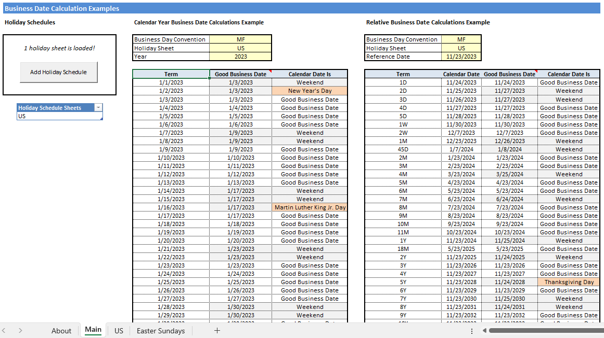
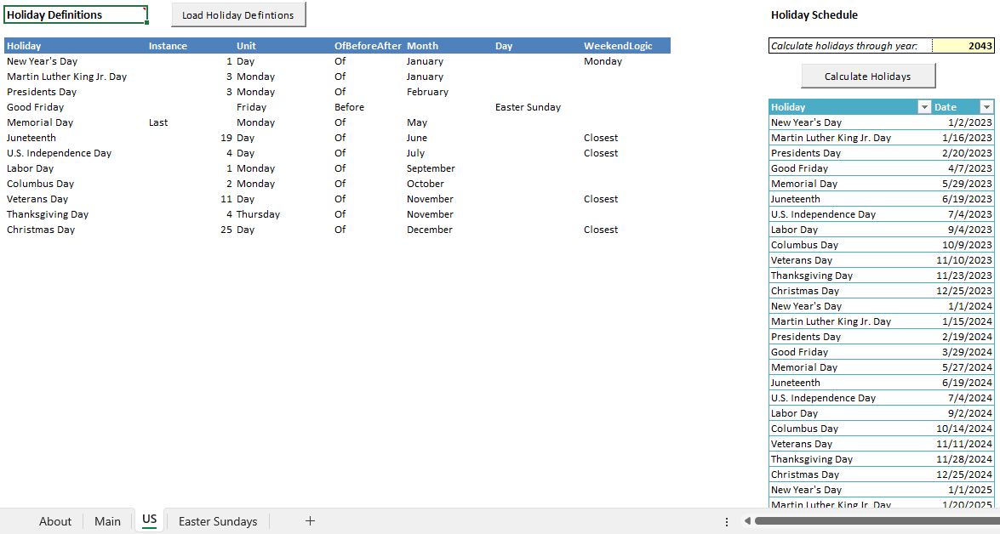

# business-day-calculator

Excel/VBA Demo - Calculates business dates according to a holiday schedule and business day convention.

## Inspiration

As part of the hiring process before I joined the Desktop Build Group as an Excel/VBA specialist at Bloomberg in 2015, they asked me to send over a sample project for them to review. I remember thinking, "Wait, the 8+ years of industry experience described on my resume isn't enough to get me past the initial HR interview, and you actually want me to **prove** I can do this work? Well, alright then, I guess that seems fair." I also remember my next thought: "Uh-oh."

The problem was that every VBA project I had ever done either belonged to the companies I had previously worked for and thus could not be shared even if I had them in my possession (which I didn't), or was a monstrous fantasy football tool that was not designed to be shared with anyone. I needed to come up with something quick, before this job opportunity passed me by.

And so I spent a couple days creating this little tool as a more applicable example of what I could do. It probably has no real-world application (although if you see one, please feel free to use it!), but it demonstrates a wide array of Excel & VBA application design concepts:

### Excel Design Concepts

- Clean sheet design, organized to flow from left to right and then top to bottom	
- Table-driven design, with strong reliance on Excel table objects	
- Conditional formatting	
- Named ranges	
- Data validation	
- Effective use of cell comments	

### VBA Concepts

- User-defined functions that can be used in the spreadsheet
- Automation with workbook and worksheet event handlers
- Automation with command button controls
- Robust error handling
- Custom-designed user form for data entry
- Retrieving data from an external website via HTTP
- Use of a class module to treat copies of a worksheet as their own custom objects, using WithEvents to trap the events of the sheet and its control objects
- Use of a custom container class to store multiple instances of custom objects

&nbsp;

This project was instrumental in getting me through the next four rounds of interviews at Bloomberg before eventually securing a job offer. I've given it a fresh update for 2023, and if you're looking for an Excel/VBA developer, please check it out and contact me if you like it!

## Usage

1. Download these files to a local directory:
	
	- BusinessDayCalculator.xlsm
	- CanadaHolidayDefs.csv
	- USHolidayDefs.csv
	
2. Open BusinessDayCalculator.xlsm and see the 'About' tab for further instructions.

## Screenshots

#### Main Sheet

#### A Holiday Definition Sheet

